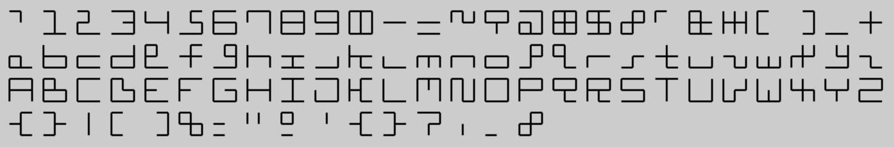
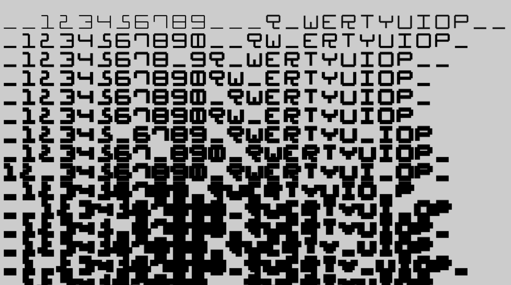

# 12-Bit
12-Bit font utilizes a 3-column-3-row grid as start and end points for 6 vertical and 6 horizontal segments of lines that are allowed to join these points in the shortest way possible. 
With this concept in mind, out of 2^12 = 4096 signs available, only some were carefully chosen to represent all large and small characters of the standard Latin alphabet. Enjoy!

[Demo](https://herbowicz.github.io/12/) (start typing, try w/caps lock too)

## Sample text


## Letters and numbers


Different font widths can obscure readability.


## A Unique Approach to Cryptography and Design

**A novel approach to representing characters using a minimal set of lines.**

This project explores the concept of the 12-Bit font, a unique way to represent characters using a binary code and basic line segments. This approach offers exciting possibilities in cryptography, design, and other security applications.

### How it Works

1. **Character Representation:**

Each character is represented by a 12-bit binary code. Each bit corresponds to a specific line segment within a 3x3 grid.

```
[1, 1, 1, 1, 0, 0, 1, 1, 0, 0, 1, 1] // A
[1, 0, 1, 1, 1, 1, 1, 1, 1, 0, 0, 1] // B
[1, 1, 0, 0, 1, 1, 1, 1, 0, 0, 0, 0] // C
```

2. **Canvas Rendering:**

The binary code is used to determine which line segments to draw on a canvas. For example, the first bit indicates whether the top horizontal line should be drawn.

```javascript
ctx.moveTo(s+l,s+d); if (sign[at][0]) { ctx.lineTo(s*2+l,s+d); } 
ctx.moveTo(s*2+l,s+d); if (sign[at][1]) { ctx.lineTo(s*3+l,s+d); }
// ...
```

### Benefits and Applications

1. **Cryptography:**

* **Steganography:** Embed information within images or other media using the minimalist nature of the font.
* **Security Tokens:** Create unique visual patterns for security tokens or watermarks.
* **Cryptography:** Utilize the binary representation as input for cryptographic algorithms.

2. **Design:**

* **Unique Typography:** Add a distinctive aesthetic to design projects with the font's style.
* **Minimalist Design:** Align your project with minimalist design principles using the font's simplicity.
* **Interactive Art:** Create interactive art installations or digital experiences with the font.

3. **Accessibility:**

* **Simplified Character Recognition:** The reduced number of elements can make character recognition easier for certain applications, such as OCR.
* **Universal Design:** Adapt the font for various screen sizes and resolutions due to its simplicity.

### Future Directions

* **Dynamic Font Generation:** Explore techniques to generate custom fonts based on specific design constraints or security requirements.
* **Font Optimization:** Optimize the font for different rendering contexts, such as web, print, and mobile devices.
* **Security Analysis:** Conduct a thorough security analysis to identify potential vulnerabilities and strengthen the font's security properties.

The 12-Bit font offers a promising approach with potential applications in various fields. By leveraging its unique characteristics, we can unlock new possibilities for creative endeavors and security advancements.
