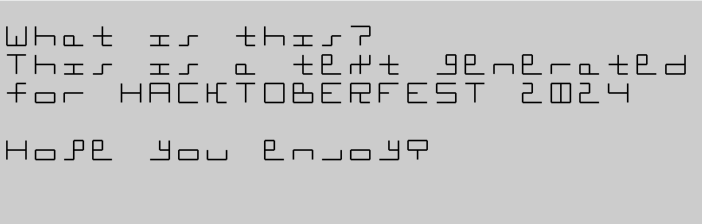

# 12 Lines
12 Lines Font utilizes a 3-column-3-row grid as start and end points for 6 vertical and 6 horizontal segments of lines that are allowed to join these points in the shortest way possible. 
With this concept in mind, out of 2^12 = 4096 signs available, only some were carefully chosen to represent all large and small characters of the standard Latin alphabet. Enjoy!

[Demo](https://herbowicz.github.io/12/) (start typing, try w/caps lock too)

## Sample text

Why Generate Letters from HTML Canvas Lines for Cryptography?
While using HTML canvas to generate letters for cryptographic purposes might seem unconventional, it offers some intriguing possibilities:

1. Unique Randomness:

Noise-Based Generation: By manipulating canvas elements like lines, curves, or random pixel patterns, you can generate visually distinct letters.
Seed-Based Variation: Using different seeds or initial conditions can lead to a vast range of letter variations, making it difficult for attackers to predict patterns.

2. Visual Obfuscation:

Camouflaging Information: Embedding information within complex canvas-generated images can make it harder for attackers to identify and extract sensitive data.
Steganography: By hiding messages within seemingly random patterns, you can create a more secure form of communication.   

3. Human-Resistant Challenges:

CAPTCHA-like Applications: Creating visually challenging CAPTCHAs that require users to identify letters generated from canvas elements can deter automated attacks.
User Verification: Implementing unique visual puzzles that only humans can solve can be used for authentication purposes.

4. Art and Design Applications:

Dynamic Typography: Generating unique fonts or letterforms based on canvas manipulations can add a creative and artistic element to design projects.
Interactive Art: Creating interactive art pieces that respond to user input by generating dynamic letterforms.
However, it's important to note that:

Security: While canvas-based techniques can add a layer of complexity, strong cryptographic algorithms and secure protocols are still essential for robust security.
Performance: Generating letters on-the-fly can be computationally expensive, especially for large-scale applications.
Accessibility: Ensure that any visual challenges or puzzles are accessible to users with disabilities.
In conclusion, while using HTML canvas to generate letters for cryptography and other purposes is an interesting approach, it should be used in conjunction with other proven security measures. The specific implementation and application would determine its effectiveness and suitability for a particular use case.